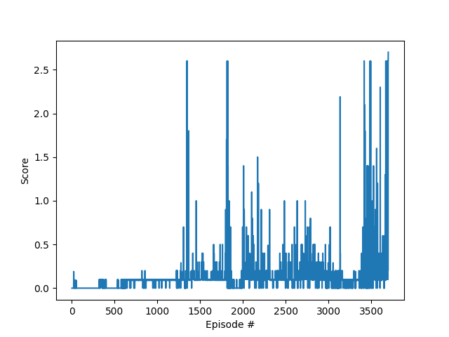

# Project 3: Collaboration and Competition

## Learning Algorithm
This project uses Deep Deterministic Policy Gradient (DDPG) to train a group of robotic arms to track green spheres that move around them. DDPG involves using  neural networks as a policy estimator and an action value estimator in and actor-critic method. The policy/actor network learns to output the best policy for every state, while the action-value/critic network learns the action values for eacy state and optimal policy pair. Thus, the two networks can jointly learn from each other to optimize the policy and action value estimation. This independence from the environment leads to less of a concern of bias or variance than a pure poliy-based or value-based method.

The actor network had the following architecture:

* `Dense`: 24x128
* `ReLU`: 128
* `Dense`: 128x128
* `ReLU`: 128
* `Dense`: 128x4
* `Tanh`: 2

All dense layers have biases. The final Tanh layer allows the action outputs to take on values between -1 and +1.

The critic network had the following architecture:

* `Dense`: 24x128
* `ReLU`: 128
* `Concatenate`: (128, 2)x130
* `Dense`: 130x128
* `ReLU`: 128
* `Dense`: 128x2

All dense layers have biases. The final dense layer does not have a ReLU activation so that the action-value estimates can take on both positive and negative values.

# Plot of Rewards
The following hyperparameters were used to train the agent that obtained the following plot of scores:

* Number of Episodes: 10000
* Max Steps per Episode: 1000
* Initial Epsilon: 1.0
* Epsilon Decay: 0.995
* Minimum Epsilon: 0.01
* Alpha: 1.0
* Replay Buffer Size: 10000
* Batch size: 128
* Gamma (discount factor): 1.0
* Tau (soft update parameter): 0.001
* Actor Learning Rate: 0.001
* Critic Learning Rate: 0.005
* Target Network Update Rate: 4 (train steps)
* Optimizer: Adam

As can be seen in the plot, it took about 3500 iterations to reach a semi-stable solution. Right around the 3,250th episode, the training score grew steadily and was able to maintain an average of 0.513 over 100 consecutive episodes.

## Ideas for Future Work
There is a very large number of parameters and hyperparameters to vary. 

All of the parmaeters/hyperparameters listed in the previous section could be varied to achieve faster convergence and/or a higher score. It would be interesting to use a hyperparameter optimizer to robustly search over the high-dimensional parameter-space. I actually had a lot of trouble with tuning the learning rates, where I tried about 15 different combinations. Once I picked a good combination, however, the training went very smoothly.Setting the actor learning rate to a value smaller than the critic learning rate seemed to produce more stable results at later iterations.

For the models themselves, the number of dense layers could be varied. It would be interesting to see how few layers are needed, or how few neurons per dense layer are needed to solve the environment. The model activations could also be adjusted. A parametric ReLU activation could be used to optimize the slope of the ReLU function. An ELU could be used to exponentially weight the higher activations. A Leaky ReLU could be applied after the final dense layer in the critic model so that negative and positive values could have an activation applied.

Additionally, different actor-critic algorithms could be experimented with. Since the parallel environment is in use, any of the PPO, A3C or D4PG algorithms could be used. A3C and D4PG would be relatively easy to implement since they are actor-critic methods and only the `Agent` class would need to be changed.